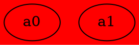
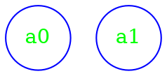
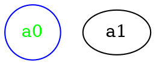
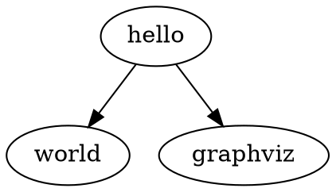
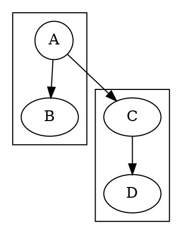
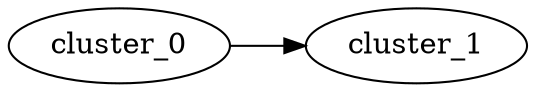
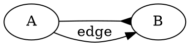

需要注意的是，当使用 `dot -Tpng input.dot` 生成图片时候，一定要加上 `-o output.png` 指定输出文件。
## dot的语法
dot的语法定义如下所示:
<pre>
graph	    :	[ <b>strict</b> ]  (<b>graph</b> | <b>digraph</b>)  [ ID ]  '<b>{</b>'  stmt_list  '<b>}</b>'  
stmt_list   :	[ stmt [ '<b>;</b>' ] stmt_list ]
stmt	    :	node_stmt
            |	edge_stmt
            |  	attr_stmt
            |	ID '<b>=</b>' ID
            |	subgraph
attr_stmt   :	(<b>graph</b> | <b>node</b> | <b>edge</b>) attr_list
attr_list   :	'<b>[</b>' [ a_list ] '<b>]</b>' [ attr_list ]
a_list	    :	ID '<b>=</b>' ID [ ('<b>;</b>' | '<b>,</b>') ] [ a_list ]
edge_stmt   :	(node_id | subgraph) edgeRHS [ attr_list ]
edgeRHS     :	edgeop (node_id | subgraph) [ edgeRHS ]
node_stmt   :	node_id [ attr_list ]
node_id     :	ID [ port ]
port        :	'<b>:</b>' ID [ '<b>:</b>' compass_pt ]
            |	'<b>:</b>' compass_pt
subgraph    :	[ <b>subgraph</b> [ ID ] ] '<b>{</b>' stmt_list '<b>}</b>'
compass_pt  :	(n | ne | e | se | s | sw | w | nw | c | _)
</pre>
加粗表示终结符、没有加粗表示非终结符。关键字**node**、**edge**、**graph**、**digraph**、**subgraph**以及**strict**不区分大小写。

其 antlr4 语法如下:

```antlr4
/*
 copy from https://github.com/antlr/grammars-v4.git
 */

grammar Dot;

graph_list: graph+ EOF;

graph: STRICT? ( GRAPH | DIGRAPH) id_? '{' stmt_list '}';

stmt_list: ( stmt ';'?)*;

stmt:
	node_stmt
	| edge_stmt
	| attr_stmt
	| id_ '=' id_
	| subgraph;

attr_stmt: ( GRAPH | NODE | EDGE) attr_list;

attr_list: ( '[' a_list? ']')+;

a_list: ( id_ ( '=' id_)? ','?)+;

edge_stmt: ( node_id | subgraph) edgeRHS attr_list?;

edgeRHS: ( edgeop ( node_id | subgraph))+;

edgeop: '->' | '--';

node_stmt: node_id attr_list?;

node_id: id_ port?;

port: ':' id_ ( ':' id_)?;

subgraph: ( SUBGRAPH id_?)? '{' stmt_list '}';

id_: ID | STRING | HTML_STRING | NUMBER;

// "The keywords node, edge, graph, digraph, subgraph, and strict are case-independent"

STRICT: [Ss] [Tt] [Rr] [Ii] [Cc] [Tt];

GRAPH: [Gg] [Rr] [Aa] [Pp] [Hh];

DIGRAPH: [Dd] [Ii] [Gg] [Rr] [Aa] [Pp] [Hh];

NODE: [Nn] [Oo] [Dd] [Ee];

EDGE: [Ee] [Dd] [Gg] [Ee];

SUBGRAPH: [Ss] [Uu] [Bb] [Gg] [Rr] [Aa] [Pp] [Hh];

/** "a numeral [-]?(.[0-9]+ | [0-9]+(.[0-9]*)? )" */ NUMBER:
	'-'? ('.' DIGIT+ | DIGIT+ ( '.' DIGIT*)?);

fragment DIGIT: [0-9];

/** "any double-quoted string ("...") possibly containing escaped quotes" */ STRING:
	'"' ('\\"' | .)*? '"';

/** "Any string of alphabetic ([a-zA-Z\200-\377]) characters, underscores
 ('_') or digits ([0-9]),
 not beginning with a digit"
 */
ID: LETTER ( LETTER | DIGIT)*;

fragment LETTER: [a-zA-Z\u0080-\u00FF_];

/** "HTML strings, angle brackets must occur in matched pairs, and
 unescaped newlines are
 allowed."
 */
HTML_STRING: '<' ( TAG | ~ [<>])* '>';

fragment TAG: '<' .*? '>';

COMMENT: '/*' .*? '*/' -> channel(HIDDEN);

LINE_COMMENT: '//' .*? '\r'? '\n' -> channel(HIDDEN);

/** "a '#' character is considered a line output from a C preprocessor (e.g.,
 # 34 to indicate
 line
 34 ) and discarded"
 */
PREPROC: '#' ~[\r\n]* -> channel(HIDDEN);

WS: [ \t\n\r]+ -> skip;
```


## 一些特性
同一个属性可以声明多次，并且会覆盖掉之前的声明。属性可以用引号也可以不用


digraph {
  bgcolor=yellow;
  bgcolor = green ;
  bgcolor = "red";

  a0;
  a1;
}



如图所示，前面的两条 `bgcolor` 的属性被最后一条覆盖掉了，因此显示为红色。


当颜色使用`#`加十六进制的时候，如 `#ff00ff`，需要使用引号。


`graph`、`edge` 和 `node` 的属性定义也是一样。如下所示:



digraph {
  node [shape=box fontcolor ="green"];
  node [shape=circle color="blue"]

  a0;
  a1;
}


如图，定义了两次 `node` 的属性，两次都定义了 `shape` 属性，因此第二次的定义覆盖掉了第一次的定义，所以顶点显示为圆形。而第一次定义了 `fontcolor` ，第二次没有重新定义，因此字体颜色依然是绿色。第二次定义了顶点的颜色为 `blue`，自然显示为蓝色。

顶点也可以声明多次，覆盖方式和上面一样。而顶点无论声明多少次，都只有一个点(这一点和边不同，边声明多次则会有多条边)。


digraph {
  a0 [shape=box fontcolor ="green"];
  a0 [shape=circle color="blue"];

  a0;
  a1;
}



如果顶点的声明使用了引号，和不使用引号的方式相同。




digraph {
  "hello" -> "world";
  hello -> "graphviz"; 
}

如上图所示，这里使用带引号的方式定义了一个名为 `hello` 的顶点，又采用了不带引号的方式定义了一个同名顶点。`graphviz` 将这两个顶点视为了同一个。

可以直接使用 `utf8` 字符串定义顶点。


`dot` 里面符号的作用域是全局的。如下所示。


digraph {
  subgraph cluster_0 {
    A [shape=box];
    A -> B;
  };
  subgraph cluster_1 {
    rankdir = "LR";
    C -> D;
  };
  A [shape=circle];
  A -> C;
}

`graphviz` 将在 `subgraph` 内外定义的名称相同的点视为同一个点。
不能使用 `subgraph` 的名称来创建两个 `subgraph` 之间的边。


digraph {
  rankdir = LR;
  subgraph cluster_0 { A -> B; };
  subgraph cluster_1 { C -> D;};
  cluster_0 -> cluster_1;
}


多次声明同样的边，会得到多条边。


digraph {
  rankdir = LR;
  A -> B [arrowhead=inv];
  A -> B [label="edge" decorate="true"];
}



