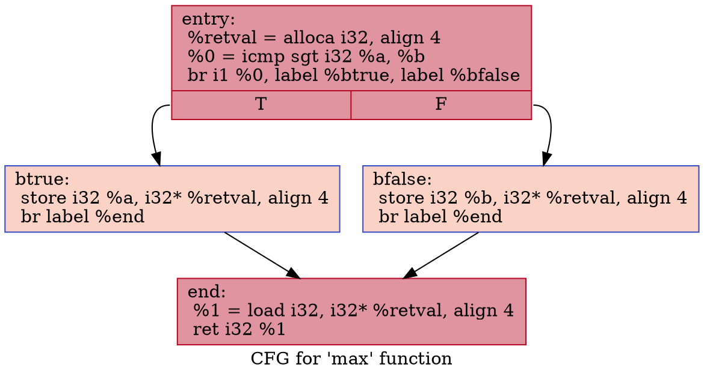

与低级汇编语言类似，LLVM 的 IR 由按顺序执行的指令序列组成。 这些指令组合在一起形成基本块。 每个基本块都以改变程序控制流的指令结束。
## if-else分支结构
首先让我们看一个非常简单的函数，它计算两个整数的最大值。 这是使用单个 if 控制语句实现的。
```cpp
int max(int a, int b) {
  if (a > b) {
    return a;
  } else {
    return b;
  }
}
```
请记住，在 LLVM 中，IR 控制流是通过在基本块之间跳转来实现的，这些基本块包含不改变控制流的指令序列。 每个基本块都以改变控制流的指令结束。 最常见的分支指令是 `br` (参见[LangRef: br](https://llvm.org/docs/LangRef.html#br-instruction))。 `br` 以一个布尔条件标志和两个基本块标签作为参数。
```llvm
br i1 %cond, label %iftrue, label %iffalse
```
`br`也可以用于无条件跳转。
```llvm
br label %dest
```
```llvm
define i32 @max(i32 %a, i32 %b) {
entry:
  %retval = alloca i32, align 4
  %0 = icmp sgt i32 %a, %b
  br i1 %0, label %btrue, label %bfalse

btrue:                                      ; preds = %2
  store i32 %a, i32* %retval, align 4
  br label %end

bfalse:                                     ; preds = %2
  store i32 %b, i32* %retval, align 4
  br label %end

end:                                     ; preds = %btrue, %bfalse
  %1 = load i32, i32* %retval, align 4
  ret i32 %1
}
```
在上面的示例中，有 4 个基本块。 第一个是函数入口块。 使用 alloca (见[LangRef: alloca](http://llvm.org/docs/LangRef.html#alloca-instruction)) 在堆栈上分配空间，用于保存结果。 然后使用 icmp 指令 (详见[LangRef: icmp](http://llvm.org/docs/LangRef.html#icmp-instruction)) 比较两个参数 `%a` 和` %b`。 结果是一个布尔 (i1) 标志，将其用作 `br` 指令的条件。 然后根据所采用的分支，将 `%a` 或 `%b` 存储到临时 `%retval` 变量中。 然后每个分支都以无条件分支到最后一个基本块 `%end` 结束。 来自 `%retval` 的值被加载并返回。

您可以以控制流图 (CFG) 的形式获得控制流的图形表示。 这可以通过使用 `opt -dot-cfg input.ll` 生成。
生成的.dot文件如下所示。

可以通过`dot -Tjpg .\.max.dot -o main.jpg`命令来生成控制流图，`dot`的安装可以参考博客[graphviz安装教程](https://qiu-weidong.github.io/2022/04/30/graphviz/start/)。生成的控制流图如下图所示。

LLVM IR 是一种相当丰富的中间代码格式。 因此，当以更高的优化级别编译上述代码段时，LLVM 将优化代码以使用 select 指令 (详见[LangRef: select](http://llvm.org/docs/LangRef.html#select-instruction)) 而不是生成分支。 选择指令只是根据布尔条件在两个值之间进行选择。 这大大缩短了代码。
```llvm
define i32 @max(i32 %a, i32 %b) {
  %1 = icmp sgt i32 %a, %b
  %2 = select i1 %1, i32 %a, i32 %b
  ret i32 %2
}
```
## 静态单赋值结构和PHI
继续上一节中的 `max` 例子。
```cpp
int max(int a, int b) {
  if (a > b) {
    return a;
  } else {
    return b;
  }
}
```
```llvm
define i32 @max(i32 %a, i32 %b) {
entry:
  %retval = alloca i32, align 4
  %0 = icmp sgt i32 %a, %b
  br i1 %0, label %btrue, label %bfalse

btrue:                                      ; preds = %2
  store i32 %a, i32* %retval, align 4
  br label %end

bfalse:                                     ; preds = %2
  store i32 %b, i32* %retval, align 4
  br label %end

end:                                     ; preds = %btrue, %bfalse
  %1 = load i32, i32* %retval, align 4
  ret i32 %1
}
```
我们可以看到该函数使用 alloca (详见[LangRef: alloca](http://llvm.org/docs/LangRef.html#alloca-instruction)) 在堆栈上分配空间，其中存储了较大的值。 在一个分支中，`%a` 被存储，而在另一个分支中，`%b` 被存储到堆栈分配的内存中。 但是，我们希望尽可能避免使用内存加载/存储操作，而是使用寄存器。 所以我们想写这样的东西：
```llvm
; 注意，这段代码不能够运行
define i32 @max(i32 %a, i32 %b) {
entry:
  %0 = icmp sgt i32 %a, %b
  br i1 %0, label %btrue, label %bfalse

btrue:
  %retval = %a
  br label %end

bfalse:
  %retval = %b
  br label %end

end:
  ret i32 %retval
}
```
这不是有效的 LLVM IR，因为它违反了 LLVM IR 的静态单赋值形式 (详见[SSA](https://en.wikipedia.org/wiki/Static_single_assignment_form))。 SSA 形式要求每个变量只赋值一次。 SSA 形式支持并简化了大量的编译器优化，并且是命令式编程语言编译器中中间表示的事实上的标准。

那么如何以适当的 SSA 形式实现上述代码？ 答案是神奇的 `phi` 指令。 `phi` 指令以SSA理论中使用的φ函数命名。 这个函数会根据控制流神奇地选择正确的值。 在 LLVM 中，您必须手动指定值的名称和前一个基本块。
```llvm
end:
  %retval = phi i32 [%a, %btrue], [%b, %bfalse]
```
这里我们指示 `phi` 指令在前一个基本块为 `%btrue` 时选择 `%a`。 如果之前的基本块是 `%bfalse`，那么将使用 `%b`。 然后将该值分配给一个新变量 `%retval`。 在这里你可以看到完整的代码清单：
```llvm
define i32 @max(i32 %a, i32 %b) {
entry:
  %0 = icmp sgt i32 %a, %b
  br i1 %0, label %btrue, label %bfalse

btrue:                                      ; preds = %2
  br label %end

bfalse:                                     ; preds = %2
  br label %end

end:                                     ; preds = %btrue, %bfalse
  %retval = phi i32 [%a, %btrue], [%b, %bfalse]
  ret i32 %retval
}
```
### PHI的后端实现原理
让我们看看 `@max` 函数现在如何映射到实际的机器代码。 我们将看看编译器后端生成了什么样的汇编代码。 在这种情况下，我们将查看为 x86 64 位生成的代码，并使用不同的优化级别进行编译。 我们将从非优化后端(`llc -O0 -filetype=asm`)开始。 我们将得到类似这样的程序集： 
```asm
max:                                    # @max
# %bb.0:                                # %entry
    cmpl    %esi, %edi                  # %edi = %a, %esi = %b
    jle     .LBB0_2
# %bb.1:                                # %btrue
    movl    %edi, -4(%rsp)              # mov src, dst
    jmp     .LBB0_3
.LBB0_2:                                # %bfalse
    movl    %esi, -4(%rsp)              # mov src, dst
    jmp     .LBB0_3
.LBB0_3:                                # %end
    movl    -4(%rsp), %eax              # return value in eax
    retq
```
参数 `%a` 和 `%b` 分别在 `%edi` 和 `%esi` 中传递。 我们可以看到编译器后端生成的代码使用堆栈来存储更大的值。 因此，当我们编写 LLVM IR 时，编译器后端生成的代码并不是我们所想的。 原因是编译器后端需要用真机指令来实现 `phi` 指令。 通常这是通过分配给一个寄存器或存储到一个公共堆栈内存位置来完成的。 通常编译器后端将使用堆栈来实现 `phi` 指令。 但是，如果我们在后端使用更多优化(即 `llc -O1`)，我们可以获得更优化的版本：
```asm
max:                                    # @max
# %bb.0:                                # %entry
    cmpl    %esi, %edi
    jg      .LBB0_2
# %bb.1:                                # %bfalse
    movl    %esi, %edi
.LBB0_2:                                # %end
    movl    %edi, %eax
    retq
```
这里的 `phi` 函数是通过使用 `%edi` 寄存器实现的。 在一个分支中，`%edi` 已经包含所需的值，所以什么也没有发生。 在另一个分支中，`%esi` 被复制到 `%edi`。 在 `%end` 基本块中，`%edi `包含来自两个分支的所需值。 这更像是我们的想法。 我们可以看到优化是需要在整个编译管道中应用的东西。